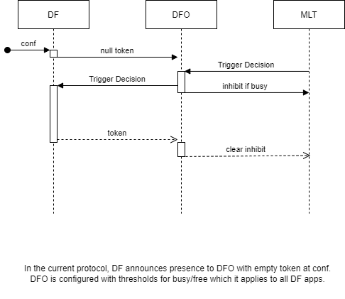
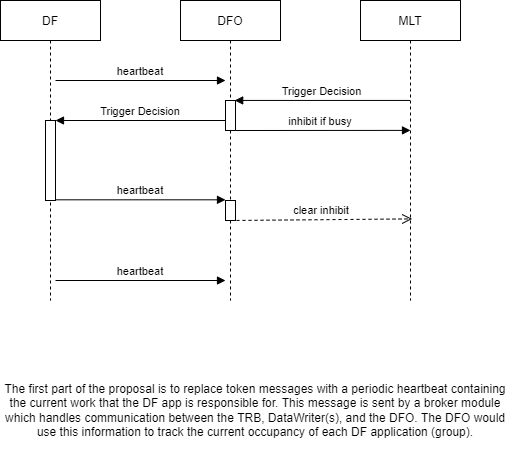
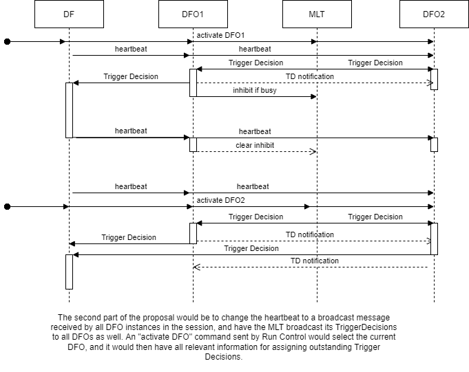
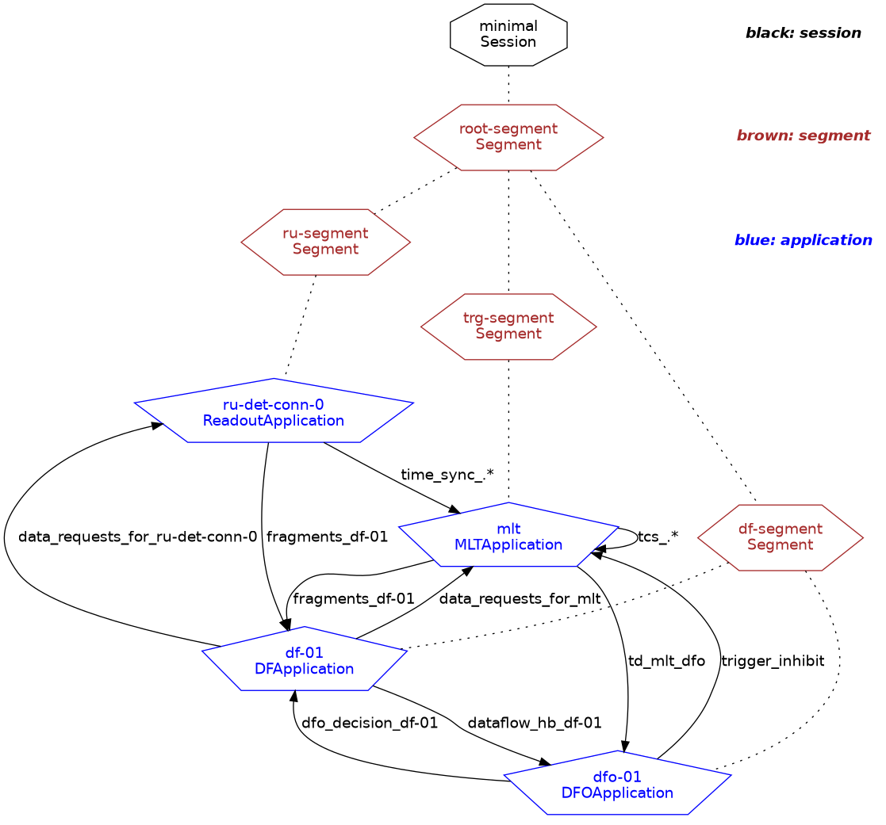
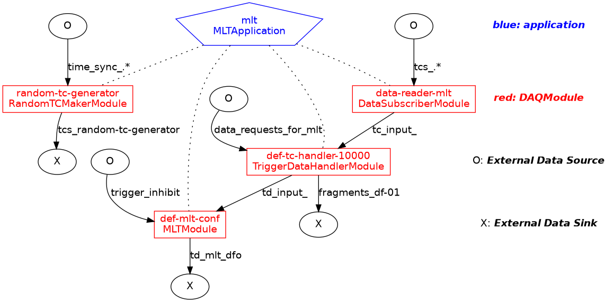
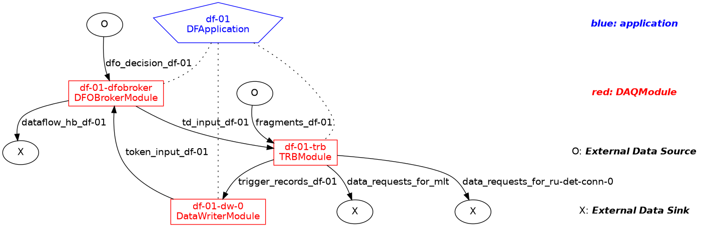
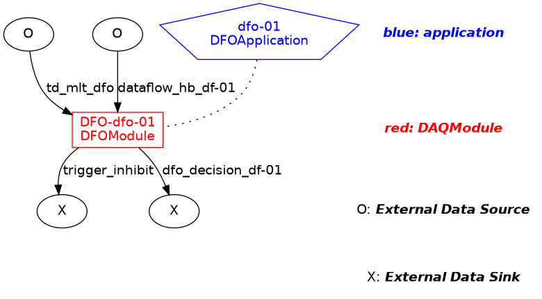

# The DFO Protocol

## Background

The DFO process is responsible for accepting TriggerDecisions from the MLT and distributing them to the Dataflow applications for event-building and data writing. It uses messages from the Dataflow application to determine their current load, and if necessary, will issue an Inhibit message to the MLT to allow the Dataflow time to catch up.

At the 2024 Application Framework Review Workshop, the DFO was identified as a cricical single-point-of-failure in the DAQ system.

## The Old DFO Protocol

In the original design, the DFO received tokens from the Dataflow applications, which indicated that a TriggerRecord had been completed. The DFO would use the number of tokens received to calculate the busy status. These tokens, and TriggerDecision messages, were sent in one-to-one mode on the network.

## The New DFO Protocol

The idea behind the new DFO protocol is that the control messages now are broadcasts (Pub/Sub) rather than one-to-one. The Dataflow application sends a periodic heartbeat message which contains information about the number of TriggerRecords currently being built and written.

The advantage of this change is that now multiple DFOs can listen to the broadcast heartbeat and TriggerDecision messages, and create their own "DFODecision" messages in response to a complete view of the system. One DFO application is designated as the "active" DFO, and the Dataflow and MLT application ignore messages from inactive DFOs. Run control has an "enable_dfo" message, which when sent to these processes changes the DFO ID that they accept information from. (No change is needed on the DFO side, since they always operate as if they are active.) Heartbeat messages are used by non-active DFOs to update their view of the running system in case different decisions were reached (i.e. a TriggerRecord was assigned to a different Dataflow application by an inactive DFO than by the active DFO).

### DFO hand-off (enable_dfo command)

Each DFO in the system always operates as if it is "enahbled". For DFO applications that are not enabled, it integrates conflicting information received in DataflowHeartbeat messages into its current picture of the running system [(code)](https://github.com/DUNE-DAQ/dfmodules/blob/8b5160dc40c646a8abc8a54f792bafe9509bfcf0/plugins/DFOModule.cpp#L431). The DFOBrokerModule in the Dataflow application keeps track of the DFOs it has received DFODecision messages from, and maintains a per-DFO list of recently-completed trigger records that are awaiting acknowledgement by that DFO. (The DFODecision message contains these acknowledgements, as well as a fresh TriggerDecision).

The MLT application uses its sense of "active" DFO only to determine which TriggerInhibit messages to honor. It does not change its inhibit state when the active DFO changes, but the DFO has been updated to send TriggerInhibit messages at regular intervals in addition to when the inhibit state changes. For a hand-off from DFO A to DFO B, the following action matrix applies:

| DFO B Status | DFO A Inhibited | DFO A Not Inhibited |
| --- | --- | -- |
| DFO B Inhibited | MLT remains Inhibited | DFO B will send inhibit message upon receiving TriggerDecision after busy_interval |
| DFO B Not Inhibited | DFO B will sent inhibit (clear) message after busy_interval (triggered by receive_dataflow_heartbeat) | MLT remains uninhibited |

While this makes it obvious that the busy_interval should be set to a fairly short time (default is 1000 ms), it should also be noted that since all DFOs are acting upon the same set of inputs, it is expected that they will be in the same inhibit state.

The DF Application uses its sense of "active" DFO to determine which TriggerDecisions to forward to the TRBModule. Once a TriggerDecision has been accepted, the DFOBrokerModule will reject further TriggerDecisions with that trigger number [(code)](https://github.com/DUNE-DAQ/dfmodules/blob/e8a743c7f6b5d613c13d9f9495ae82b53e9d047e/plugins/DFOBrokerModule.cpp#L304). There is a mutex lock on the DFO information structure within the DFOBrokerModule, so a change in the active DFO will only happen between processing DFODecisions.

## Configuration Notes

Relative to previous (v5.2.x) configurations, there are minimal changes necessary. 

The following changes in `daqsystemtest/connections.data.xml`:
1. A DataflowHeartbeat kPubSub NetworkConnectionDescriptor should be added
1. A DFODecision kSendRecv NetworkConnectionDescriptor should be added
1. The type of the TriggerDecisions NetworkConnectionDescriptor should be changed from kSendRecv to kPubSub
1. The TriggerDecisionToken NetworkConnectionDescriptor can be removed
1. NetworkConnectionRules for DFODecisions and DataflowHeartbeats should be added
1. The TriggerDecisionToken NetworkConnectionRule should be removed
1. QueueDescriptor for TriggerDecisionToken should be added

The following changes in `daqsystemtest/df-segment.data.xml`:
1. Updated rule references
1. Added DFOBrokerConf module configuraiton, referenced in DataflowApplication instances

The following changes in `daqsystemtest/fsm.data.xml`:
1. Added enable-dfo FSMaction, FSMtransition, and FSMxTransition

With these configuration changes, and updates to DFApplication and DFOApplication in `appmodel`, the system configuration becomes:

The MLT application is unchanged, with the exception that it is now has a configuration parameter to set the "initally-active" DFO.

Note how the DFOBroker now receives messages from the DataWriter and dispatches TriggerDecisions to the TRBModule. It is responsible for sending the periodic DataflowHeartbeat messages to the DFO.

